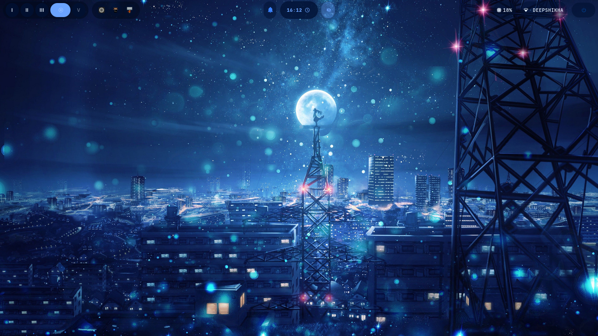
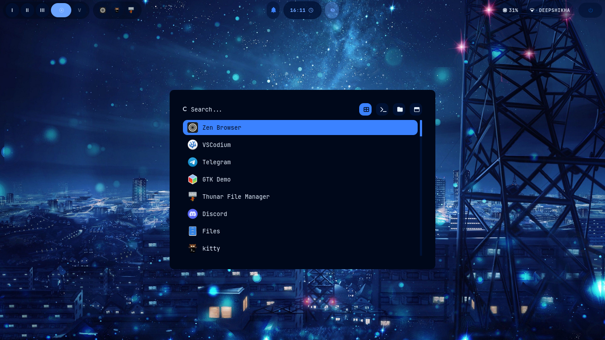
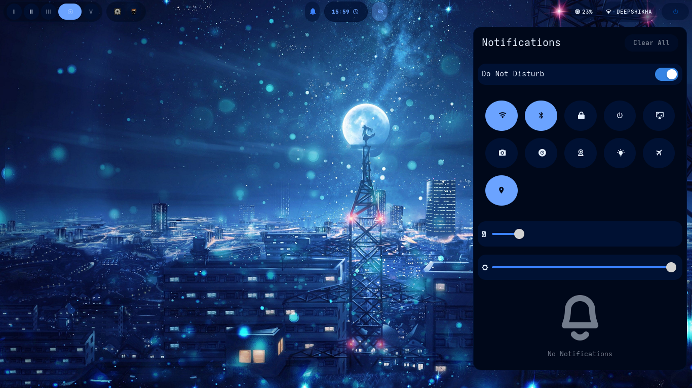
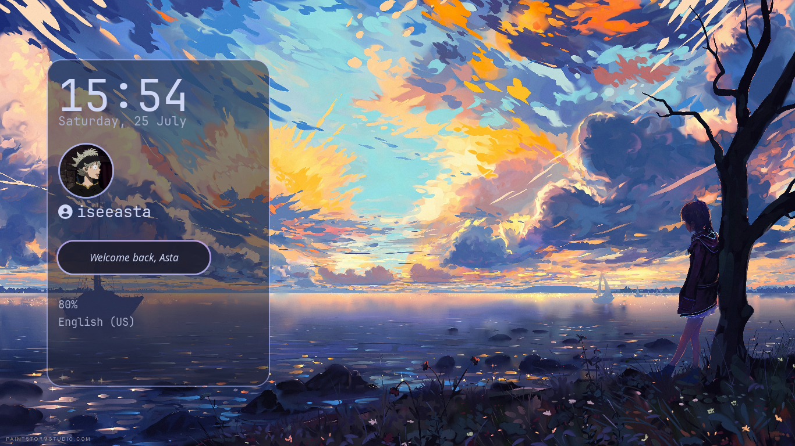
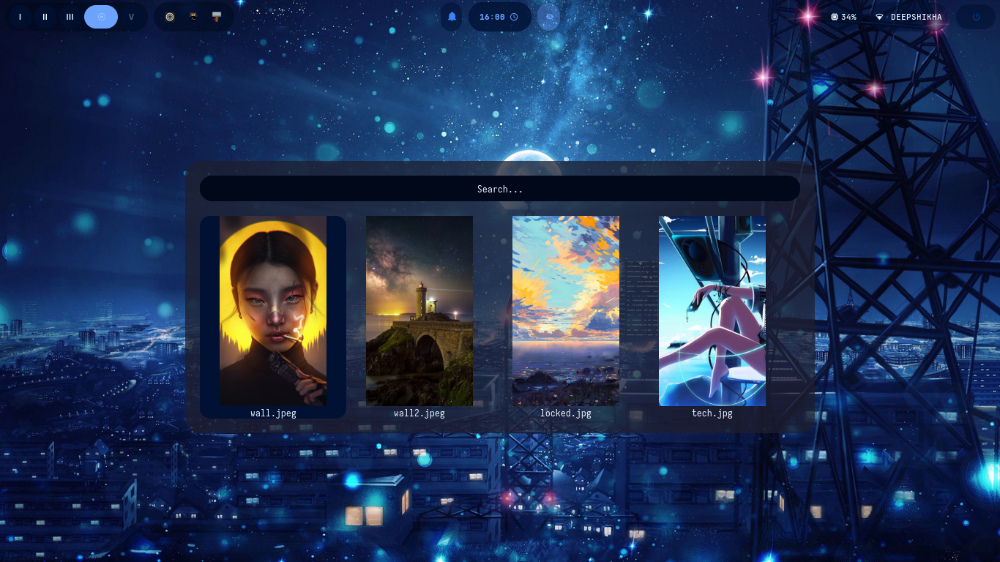
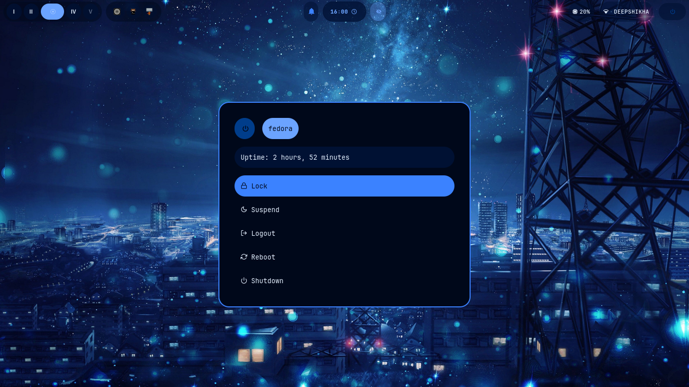
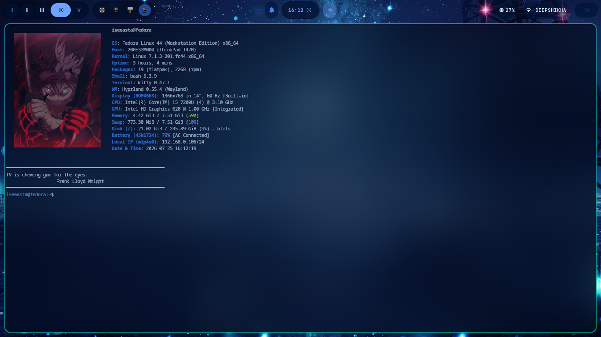

<div align="center">

# 🌿 Hyprland Dotfiles

**A fully-themed Hyprland rice with a one-key theme switcher that syncs colors and wallpaper across your entire desktop.**


One keypress (`SUPER+T`) reskins **Waybar, Rofi, SwayNC, Kitty, and your wallpaper** — all at once, all matching.

</div>

---

## 📸 Preview

<details>
<summary><b>Click to expand screenshots</b></summary>
<br>

| Desktop | App Launcher |
|---|---|
|  |  |

| Notification Center | Lock Screen |
|---|---|
|  |  |

| Wallpaper Picker | Power Menu | Terminal
|---|---|---|
|  |  |  |

</details>

<details>
<summary><b>🎥 Click to watch the theme switcher in action</b></summary>

<br>

https://github.com/user-attachments/assets/YOUR-VIDEO-ID-HERE

</details>

---

## ✨ Features

- 🎨 **Unified theme switcher** — `SUPER+T` opens a Rofi picker with 16+ themes (Catppuccin, Nord, Dracula, Gruvbox, and more). Picking one instantly recolors Waybar, Rofi, SwayNC, and Kitty, and swaps your wallpaper — all from one script.
- 🖼️ **Custom Rofi setup** — themed app launcher, power menu, and a **wallpaper picker with live thumbnail previews**.
- 🔔 **SwayNC control center** — circular icon buttons for WiFi, Bluetooth, lock, power, screenshot (area/full), screen recording, webcam snapshot, airplane mode, and location toggle — plus working volume/brightness sliders.
- 🔒 **Custom Hyprlock** — styled lock screen with clock, date, profile picture, and battery status.
- 🌦️ **Weather + AQI module** — live temperature, conditions, and air quality for your location, with a detailed hover tooltip, powered by the free Open-Meteo API (no key needed).
- ⚡ **Power profile switcher** — one-click cycling between power profiles (via `tuned-adm`).
- 🌈 **Hyprshade color filters** — toggle blue-light filter, vibrance boost, or color inversion from a Rofi picker.
- 🗂️ **Themed Thunar** file manager — matches your active palette via GTK3 CSS overrides.

---

## 📋 Prerequisites

- Fedora 44 (or similar — adjust package manager commands for your distro)
- Hyprland already installed, ideally via [Solopasha's Copr](https://copr.fedorainfracloud.org/coprs/solopasha/hyprland/)
- A UWSM-based Hyprland session is **strongly recommended** (fixes portal/systemd integration — see [Troubleshooting](#-troubleshooting))

---

## 🚀 Installation

```bash
git clone https://github.com/iseeasta/AstaHypr.git ~/AstaHypr
cd ~/AstaHypr
chmod +x install.sh
./install.sh
```

The install script will:
1. Install all required packages (Waybar, Rofi, SwayNC, Kitty, Thunar, swww, hyprlock, hyprshade, and supporting tools)
2. Back up any existing configs to `~/.config-backup-<date>/`
3. Symlink this repo's configs into `~/.config/`
4. Make all scripts executable

After install, **log out and select the "Hyprland (uwsm)" session** at your login screen (not plain "Hyprland") for full functionality — see [Troubleshooting](#-troubleshooting) for why this matters.

---

## ⌨️ Keybinds

| Key | Action |
|---|---|
| `SUPER + D` | App launcher |
| `SUPER + E` | File manager (Thunar) |
| `SUPER + Q` | Terminal (Kitty) |
| `SUPER + C` | Close window |
| `SUPER + M` | Power menu |
| `SUPER + L` | Lock screen |
| `SUPER + T` | **Theme switcher** |
| `SUPER + W` | Wallpaper picker |
| `SUPER + F` | Color shader picker |
| `SUPER + N` | Notification/control center |
| `SUPER + V` | Toggle floating |
| `SUPER + P` | Pseudo-tile |
| `SUPER + S` | Scratchpad toggle |
| `SUPER + 1-0` | Switch workspace |
| `SUPER + SHIFT + 1-0` | Move window to workspace |

Media/brightness keys (volume, mic mute, brightness, playback) are bound to their standard `XF86` keys out of the box.

---

## 🎨 Adding Your Own Theme

Themes are just color files — the whole system auto-generates everything else from them.

1. Create a new Rofi color file:
```bash
   nano ~/.config/rofi/colors/mytheme.rasi
```
```css
   * {
       background:     #1a1a1aFF;
       background-alt: #2a2a2aFF;
       foreground:     #ffffffFF;
       selected:       #ff5555FF;
       active:         #55ff55FF;
       urgent:         #ff0000FF;
   }
```
2. That's it — run the theme switcher (`SUPER+T`), and `mytheme` will already appear in the list. A matching Waybar palette is auto-generated on first use.
3. *(Optional)* Add a matching wallpaper to `~/Pictures/wallpapers/themes/mytheme.jpg` so the switcher also updates your background.


## 🖼️ Chnaging Pictures

these are just normal changeable pictures and you can choose acc to your choice

1. Chnage the name to your Pic name:
```bash
   nano ~/.config/hypr/hyprlock.conf
```
```conf
   # Profile picture
    image {
       monitor =
       path = /home/iseeasta/Pictures/Pfp/Asta1.jpg      # Here cahnge (Asta1.jpg) to (yourpicname.jpg)
       size = 90
       rounding = -1
       border_size = 3
       border_color = rgba(180, 190, 254, 0.8)
       position = 100, 90
       halign = left
       valign = center
    }
```
2. That's it — Save it & logout and Check Again
3. for terminal
```bash
   nano ~/.config/fastfetch/config.json
```
```
  "logo": {
      "type": "kitty",
      "source": "~/.config/fastfetch/YourImage.jpg",
      "width": 33,
      "padding": {
          "top": 1,
          "left": 3
        }
     }
```

---
## 🛠️ Troubleshooting

<details>
<summary><b>Portal-related errors (screenshots, accent colors, GTK settings not applying)</b></summary>
<br>

If `xdg-desktop-portal` shows `inactive (dead)`:
```bash
systemctl --user status xdg-desktop-portal.service
```

This is almost always caused by launching Hyprland **without a session manager**, which never signals `graphical-session.target` as reached. Fix: log out, and at your login screen, select **"Hyprland (uwsm)"** instead of plain "Hyprland" — UWSM properly registers the session with systemd, which fixes portals, screenshots, GTK accent colors, and more, all at once.
</details>

<details>
<summary><b>Waybar module showing blank/1px bar</b></summary>
<br>

Check `height` isn't accidentally set to `1` in `config.jsonc`, or that no CSS rule in `structure.css` is forcing `min-height: 0`.
</details>

<details>
<summary><b>Rofi/Waybar colors not syncing after switching themes</b></summary>
<br>

Every rofi `shared/colors.rasi` file must import `~/.config/rofi/colors/current.rasi`, not a hardcoded theme name. Check with:
```bash
find ~/.config/rofi -name "colors.rasi" -exec grep -H "@import" {} \;
```
</details>

<details>
<summary><b>Hyprshade shader linking error ("all shaders must use same shading language version")</b></summary>
<br>

This is a known upstream Hyprland compositor bug on some driver/version combinations. If it persists even with correctly-versioned single shaders, it's not fixable client-side — track the upstream issue or stick to fewer/simpler shaders.
</details>

---

## 📁 Repo Structure

```
AstaHypr/
├── Videos/                # video walkthrough of rice
├── fastfetch/             # fastfetch for terminal
├── Pictures/              # Contains all screenshots and PIctures
|   ├── Pfp/               # lockscreen pfp
|   └── Screenshots/       # screenshots
├── gtk-3.0/               # Thunar/GTK3 theming
├── hypr/                  # Hyprland config + Lua modules (binds, autostart)
├── kitty/                 # Terminal config
├── rofi/                  # Rofi launcher, powermenu, colors
├── swaync/                # Notification/control center config + scripts
├── waybar/                # Waybar config, themes, and scripts
├── wob/                   # wob ini (for volumes and brightness)
├── README.md
└── install.sh             # One-command installer
```

---

## 🙏 Credits

- Rofi themes based on [adi1090x/rofi](https://github.com/adi1090x/rofi)
- Color palettes inspired by [Catppuccin](https://github.com/catppuccin), Nord, Gruvbox, Dracula, and more
- Weather/AQI data from [Open-Meteo](https://open-meteo.com/)

---

<div align="center">

Built by [Sameer](https://github.com/iseeasta) — feel free to fork and make it yours.

</div>
